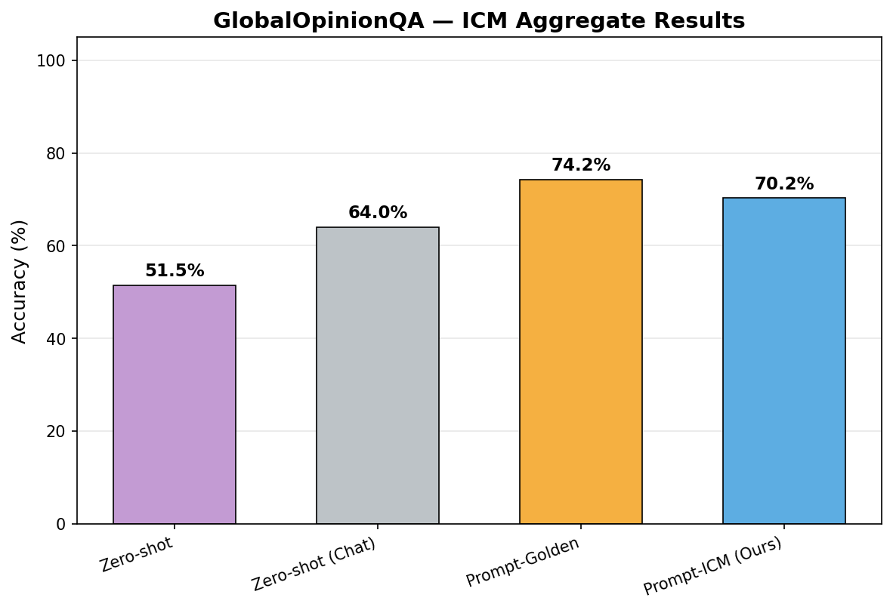
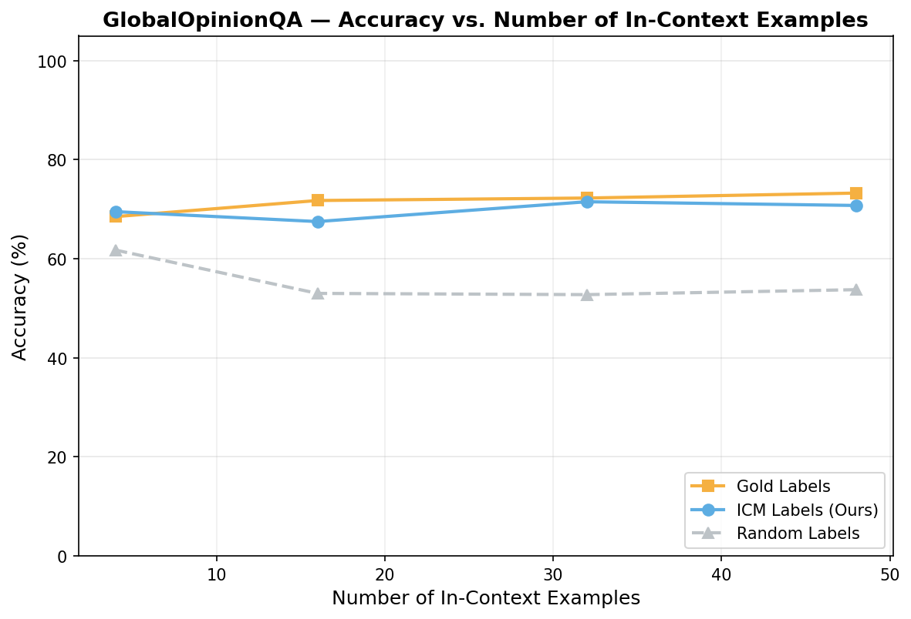

# GOQA-ICM: Internal Coherence Maximization on GlobalOpinionQA

Applying **Internal Coherence Maximization (ICM)** to the [GlobalOpinionQA](https://huggingface.co/datasets/Anthropic/llm_global_opinions) dataset for pluralistic alignment via persona-based value specification.

ICM searches for a label assignment over survey questions that maximizes mutual predictability across a country's training set — without access to gold labels. These searched labels are then used as few-shot demonstrations to align a language model's responses to country-specific opinion patterns.

---

## Table of Contents

- [Overview](#overview)
- [Pipeline](#pipeline)
- [Project Structure](#project-structure)
- [Setup](#setup)
- [Usage](#usage)
- [Configuration](#configuration)
- [Results](#results)
- [Output](#output)
- [Evaluation Conditions](#evaluation-conditions)
- [Data Format](#data-format)
- [Citation](#citation)

---

## Overview

Each country in GOQA is treated as a distinct **persona**. For each persona:

1. Binary survey questions are converted to TruthfulQA-style examples.
2. ICM (simulated annealing over label assignments) finds a coherent set of labels.
3. Those ICM labels are used as few-shot demonstrations during LLM evaluation.
4. Results are compared across four conditions: zero-shot, zero-shot chat, gold-label ICL, and ICM-label ICL.

Experiments were run on **4 countries**: United States, Britain, Germany, and Japan — using up to **256 binary training questions** and **100 binary test questions** per persona.

---

## Pipeline

```
Download data → Prepare per-country splits → Run ICM → Evaluate 4 conditions → Plot figures
```

| Step | Script | Description |
|------|--------|-------------|
| 1 | `download_data.py` | Downloads GOQA CSVs from HuggingFace and GitHub |
| 2 | `goqa_data.py` | Filters binary questions, creates train/test splits per country |
| 3 | `icm.py` | Runs simulated annealing label search per persona |
| 4 | `evaluate.py` | Evaluates 4 conditions + accuracy vs. shot count |
| 5 | `plot.py` | Generates Figure 1 (bar chart) and Figure 2 (shots curve) |
| — | `main.py` | Orchestrates all steps end-to-end |

---

## Project Structure

```
GOQAICM/
├── config.py           # API config, ICM hyperparameters, country list
├── api.py              # OpenAI-compatible API wrapper with logprob extraction
├── goqa_data.py        # GOQA loading, filtering, TruthfulQA-style formatting
├── icm.py              # ICM algorithm (simulated annealing label search)
├── evaluate.py         # Evaluation: 4 conditions + accuracy vs. num examples
├── plot.py             # Plotting: Figure 1 bar chart + Figure 2 line chart
├── main.py             # Main orchestrator
├── download_data.py    # Data download helper
├── .env.example        # Template for API credentials
├── datasets/           # Created by download/prep steps
│   ├── global_opinions.csv
│   ├── global_opinion_data.csv
│   └── <country>_train.jsonl / <country>_test.jsonl
└── outputs/            # Created by the pipeline
    ├── results.json
    ├── icm_labels_<country>.jsonl
    ├── figure1_aggregate.png
    ├── figure1_per_persona.png
    └── figure2_*.png
```

---

## Setup

### 1. Install Dependencies

```bash
pip install -r requirements.txt
```

Or manually:

```bash
pip install openai tqdm matplotlib numpy datasets
```

> Python 3.9+ recommended.

### 2. Configure API Access

Copy the example env file and fill in your credentials:

```bash
cp .env.example .env
```

Edit `.env` with your provider details. ICM **requires logprob access**, so you need a provider that exposes raw token log-probabilities (e.g. Runpod vLLM, Together AI). Fireworks only serves the instruct model, which still works but is suboptimal for ICM.

#### Option A — Runpod vLLM (recommended)

Deploy two separate vLLM pods (one for the base model, one for the instruct model), then set:

```env
API_KEY=sk-<base-pod-api-key>
API_BASE_URL=https://<base-pod-id>-8000.proxy.runpod.net/v1
BASE_MODEL=meta-llama/Llama-3.1-70B

CHAT_API_KEY=sk-<chat-pod-api-key>
CHAT_BASE_URL=https://<chat-pod-id>-8000.proxy.runpod.net/v1
CHAT_MODEL=meta-llama/Llama-3.1-70B-Instruct
```

Start the vLLM server on each pod:

```bash
# Base model pod
python -m vllm.entrypoints.openai.api_server \
    --model meta-llama/Llama-3.1-70B --port 8000

# Instruct model pod
python -m vllm.entrypoints.openai.api_server \
    --model meta-llama/Llama-3.1-70B-Instruct --port 8000
```

> Each pod requires >= 80 GB VRAM (A100 80GB or H100).

#### Option B — Together AI

```env
API_KEY=your-together-key
API_BASE_URL=https://api.together.xyz/v1
BASE_MODEL=meta-llama/Meta-Llama-3.1-70B
CHAT_MODEL=meta-llama/Meta-Llama-3.1-70B-Instruct
```

#### Option C — Fireworks (instruct only)

```env
API_KEY=your-fireworks-key
API_BASE_URL=https://api.fireworks.ai/inference/v1
BASE_MODEL=accounts/fireworks/models/llama-v3p1-70b-instruct
CHAT_MODEL=accounts/fireworks/models/llama-v3p1-70b-instruct
```

### 3. Download Data

```bash
python download_data.py
```

This downloads:
- `datasets/global_opinions.csv` from HuggingFace (`Anthropic/llm_global_opinions`)
- `datasets/global_opinion_data.csv` from GitHub (`ariba-k/llm-cultural-alignment-evaluation`)

---

## Usage

### Full Pipeline (recommended)

```bash
python main.py --goqa_csv ./datasets/global_opinions.csv \
               --github_csv ./datasets/global_opinion_data.csv
```

### Common Flags

```bash
# Quick test with fewer ICM iterations (much faster, less accurate)
python main.py --goqa_csv ./datasets/global_opinions.csv --iters 100

# Skip Figure 2 to reduce API calls significantly
python main.py --goqa_csv ./datasets/global_opinions.csv --skip_figure2

# Run on specific countries only
python main.py --goqa_csv ./datasets/global_opinions.csv \
               --countries "United States" "Britain" "Japan"

# Skip data preparation if you've already run it before
python main.py --skip_data_prep

# Skip zero-shot chat (run it separately later with --chat_only)
python main.py --goqa_csv ./datasets/global_opinions.csv --skip_chat

# Add zero-shot chat results to an existing results.json
python main.py --chat_only
```

### Individual Scripts

```bash
# Data preparation only
python goqa_data.py ./datasets/global_opinions.csv ./datasets/global_opinion_data.csv
```

### Full Flag Reference

| Flag | Default | Description |
|------|---------|-------------|
| `--goqa_csv` | `./datasets/global_opinions.csv` | Path to HuggingFace GOQA CSV |
| `--github_csv` | `None` | Path to ariba-k CSV (optional filter) |
| `--data_dir` | `./datasets` | Directory for prepared train/test splits |
| `--output_dir` | `./outputs` | Directory for results and figures |
| `--skip_data_prep` | `False` | Load previously prepared data |
| `--skip_figure2` | `False` | Skip accuracy-vs-shots evaluation |
| `--skip_chat` | `False` | Skip zero-shot chat condition |
| `--chat_only` | `False` | Run only zero-shot chat, merge into existing results |
| `--iters` | `600` | Override `NUM_ICM_ITERATIONS` |
| `--countries` | see config | Override country list |
| `--seed` | `42` | Random seed |

---

## Configuration

Key settings in [config.py](config.py):

| Parameter | Default | Description |
|-----------|---------|-------------|
| `ALPHA` | `50.0` | ICM mutual predictability weight |
| `T0` | `3.0` | Initial annealing temperature |
| `T_MIN` | `0.001` | Final annealing temperature |
| `BETA` | `0.98` | Cooling rate |
| `K_INIT` | `8` | Initial random label assignments |
| `NUM_ICM_ITERATIONS` | `600` | Search iterations per persona |
| `CONTEXT_SIZE` | `256` | Max labeled examples shown during ICM scoring |
| `MAX_FEW_SHOT` | `48` | Max demos used during evaluation |
| `TRAIN_RATIO` | `0.7` | Train/test split ratio |
| `MAX_TRAIN` | `256` | Cap on training examples per country |
| `MAX_TEST` | `100` | Cap on test examples per country |
| `COUNTRIES` | 4 countries | Personas to evaluate |
| `FEW_SHOT_COUNTS` | `[4,16,32,48]` | Shot counts tested in Figure 2 |

To change the default country list, edit `COUNTRIES` in `config.py`:

```python
COUNTRIES = [
    "United States",
    "Britain",
    "Germany",
    "Japan",
    "France",
    "India",
    # ...
]
```

---

## Results

### Figure 1 — Aggregate accuracy across all 4 conditions



Prompt-ICM achieves **70.2%** accuracy — well above zero-shot (51.5%) and zero-shot chat (64.0%), and within 4 points of Prompt-Golden (74.2%) which uses ground-truth labels.

### Figure 2 — Accuracy vs. number of in-context examples



ICM labels track gold labels closely across all shot counts (4 → 48), both far above random-label baselines — demonstrating that ICM recovers useful label signal without any access to gold annotations.

---

## Output

After a full run, `./outputs/` contains:

| File | Description |
|------|-------------|
| `results.json` | Per-persona and aggregate accuracy for all 4 conditions |
| `icm_labels_<country>.jsonl` | ICM-searched labels vs. gold labels per example |
| `figure1_aggregate.png` | Bar chart comparing 4 conditions, averaged over all personas |
| `figure1_per_persona.png` | Grouped bar chart showing per-country breakdown |
| `figure2_*.png` | Line chart of accuracy vs. number of in-context examples |

---

## Evaluation Conditions

| Condition | Model | Demonstrations |
|-----------|-------|----------------|
| **Zero-shot** | Llama-3.1-70B (base) | None |
| **Zero-shot (Chat)** | Llama-3.1-70B-Instruct | None (chat format) |
| **Prompt-Golden** | Llama-3.1-70B (base) | Gold survey majority labels |
| **Prompt-ICM (Ours)** | Llama-3.1-70B (base) | ICM-searched labels |

---

## Data Format

### TruthfulQA-style examples (per country)

Each binary GOQA question produces two examples per country:

```json
{
  "question": "Do you think the U.S. should keep troops in Iraq or remove them?",
  "choice": "Remove its troops",
  "label": "True",
  "consistency_id": 42,
  "country": "France"
}
```

- **`choice`**: One of the two binary survey options
- **`label`**: `"True"` if this option is the majority response for that country, `"False"` otherwise
- **`consistency_id`**: Groups the two options for the same question+country pair (equivalence class for ICM consistency constraints)

### ICM label output (per country)

```json
{
  "question": "...",
  "claim": "...",
  "icm_label": "True",
  "golden_label": "True",
  "country": "France"
}
```

---

## Notes

- ICM **must** use a base (non-instruct) model for clean log-probability signal. Using an instruct model for ICM degrades results.
- Running the full pipeline with all countries and `--iters 600` makes many API calls. Use `--iters 100` and `--skip_figure2` during development.
- The `--chat_only` flag lets you run the zero-shot chat condition separately (e.g. after switching to an instruct endpoint), then merge results back into the saved `results.json`.

---

## Citation

This project applies the Internal Coherence Maximization (ICM) method introduced in:

> Jiaxin Wen, Zachary Ankner, Arushi Somani, Peter Hase, Samuel Marks, Jacob Goldman-Wetzler, Linda Petrini, Henry Sleight, Collin Burns, He He, Shi Feng, Ethan Perez, Jan Leike. *Unsupervised Elicitation of Language Models.* arXiv:2506.10139, 2026. https://arxiv.org/abs/2506.10139

```bibtex
@misc{wen2026unsupervisedelicitationlanguagemodels,
      title={Unsupervised Elicitation of Language Models},
      author={Jiaxin Wen and Zachary Ankner and Arushi Somani and Peter Hase and Samuel Marks and Jacob Goldman-Wetzler and Linda Petrini and Henry Sleight and Collin Burns and He He and Shi Feng and Ethan Perez and Jan Leike},
      year={2026},
      eprint={2506.10139},
      archivePrefix={arXiv},
      primaryClass={cs.CL},
      url={https://arxiv.org/abs/2506.10139},
}
```

---

*Developed with assistance from Claude (Anthropic).*
